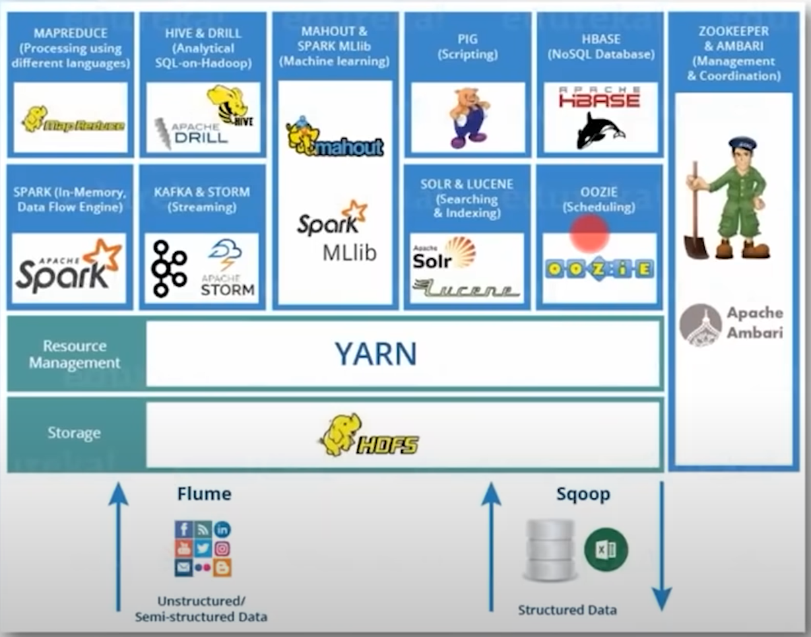

# Big Data & Hadoop

## Hadoop

### Hadoop Ecosystem

* HDFS：数据存储
* YARN：资源管理器
* 不同形式和来源的数据加载工具：
  * Flume：非结构数据的加载
  * Sqoop：结构化数据的加载
* mapreduce：计算框架&算法
* pig：提供对MapReduce的高级抽象，更加易用简洁。
  * 轻量级，削减代码量。
* Hive：提供HiveQL查询语句，使得hadoop的查询简单化。
  * 通常由数据分析师使用，而非开发人员。
  * 一般进行全表扫描
* Hbase：基于hdfs的列式的分布式数据库。
  * hdfs缺乏即时读写操作，hbase提供该功能，满足实时需要。
  * 索引访问，更加高效。
* zookeeper：针对分布式系统的协调系统。
  * 封装关键服务，比如配置维护，分布式同步等。

### Hadoop Architecture

**Master-Slave 架构**
主从模式架构分为主节点和从节点。
主节点负责管理Slave节点，数据备份，配置管理，任务分配，故障处理等。
Slave节点负责真正执行任务。

Hadoop中，HDFS和Yarn均采用了这种架构。

### HDFS

HDFS是Hadoop的核心组件之一，负责分布式数据存储。

**HDFS基本架构**
HDFS架构中主要由三类节点：NameNode，DataNode和Secondary Node.

* NameNode即Master Node，负责管理集群，元信息存储。
* DataNode即Slave Node，负责数据存储，请求处理。
* Secondary Node，不是Name Node的备份，而是保留了一个检查点，
帮助NameNode进行更快的数据修复。
  * 在NameNode启动时，需要重新加在edit log，保证内存中元数据的可靠性。
  * 如果每次都将edit log合并入fsimage，会非常影响性能。因此需要借助secondary Node
进行fsimage的更新，否则在Name Node中edit log会过大，影响启动速度。

**文件在HDFS DataNode中的数据存储方式**

* 以块（block）形式存储。
* 容错处理：备份机制。

将一个文件根据块大小，分为几块。
为了数据的可靠性，通常会将文件复制多份（复制因子），分别将同一个块
的不同备份存在不同的DataNode。
由NameNode保存存储位置的信息。

**HDFS写机制和读机制**

通过NameNode和DataNode进行协作。

主要参与组件有：

* hdfs client
* Name Node
* Core Switch
* Rack Switch
* Data Node（一个Rack中存在多个DataNode）

### Mapreduce

Hadoop生态中的重要组件，一种大型数据的计算编程模型。

### Yarn

Yarn是Hadoop生态中负责资源管理的组件，采用master-slave架构。

**Yarn架构**

Yarn主要包含两种节点：Resource manager和 Node manager。

* Resource Manager：即Master节点，负责资源管理和任务接收。
* Node Manager：即Slave节点，负责容器生成，资源监控。
* AppMaster：Node Manager会为每个应用创建一个App Master，
AppMaster会负责应用任务的调度。
* Container：由Node Manager创建，为每个应用创建多个容器， 
在容器中真正进行各种任务的执行。

### Hadoop集群

**Hadoop集群模式**

* 本地/单体模式：单JVM执行，无HDFS。
  * 本地开发模式。测试Mapreduce。
* 伪分布式模式：在单机中启动多个Hadoop守护进程模拟分布式节点。
  * 体验观察分布式模式。
* 分布式模式：生产模式。

### Hive

Hive建立在Hadoop之上，是用于对HDFS使用类sql（HiveQL）进行数据分析的工具。
hive会将sql翻译为mapreduce进行数据处理。

**为什么需要Hive**

大部分应用程序使用RDBMs进行实现，其中使用SQL作为查询语言，为了将这些应用迁移到HDFS上，需要提供
类SQL的语句对HDFS进行操作，在Hadoop生态中正是Hive。
如果没有Hive，用户需要自行迁移sql语句，非常困难。

### Hbase

Hbase是建立在HDFS上的面向列的分布式数据库。

**为什么需要Hbase**

Hadoop/HDFS只能批量处理和顺序查找，其性能底下。
为此，需要提供随机访问的功能，即Hbase数据库。

Hbase vs HDFS，其实是数据库和文件系统的对比。

Hbase具有列式数据库的一般特性：擅长分析处理（OLAP）。
适用于海量数据的随机实时查询。

**Hbase vs Hive**

随机实时查询 vs 离线批量计算（数据处理和计算）

二者一般是协作关系，数据源存入hdfs，hive从hdfs中取数据进行数据清洗，并存入hbase，提供实时查询。

