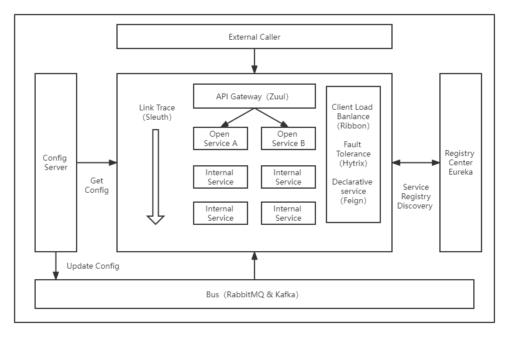

## 0. spring cloud微服务架构体系

**基本架构图**

## 2. 微服务构建：spring boot

**为什么要先了解spring boot**

spring boot是构建spring cloud微服务的基础框架。
换句话说，spring cloud微服务本身往往也是一个spring boot项目。

为了更加快速便捷地构建微服务，需要对spring boot的特性有所了解。

**spring boot的基本特性**

详见《Spring boot实战》

* 启动依赖：将依赖模块化
* 自动配置：引入包后，可以直接使用对象实例
    * bean的自动配置
    * 属性的自动配置
    

## 3. 服务治理

**为什么需要服务治理？什么是服务治理？**

微服务系统一旦变得庞大，人工难以维护服务之间的关联信息。
服务治理指服务注册和发现，换句话说，服务治理框架是通过服务注册和服务发现的功能
来实现服务治理的。

**spring cloud eureka是什么？**

spring cloud基于netflix eureka实现的一套服务治理框架。

**服务治理框架/eureka的主要组件**

* eureka服务端：服务注册中心
* eureka客户端：
  * 服务提供者
  * 服务消费者
  

